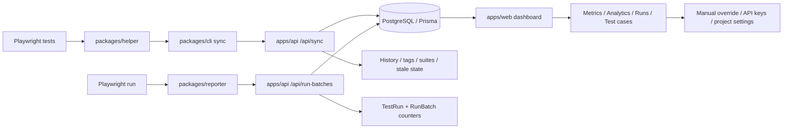
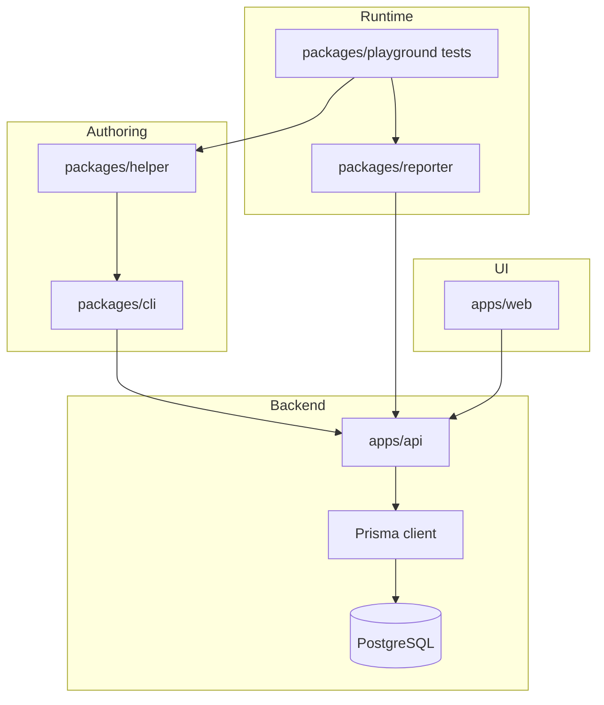

# Assertive

Assertive is a monorepo for tracking test cases, test runs, run batches, tags, suites, and history across three main surfaces:

- `packages/helper` for authoring test metadata inside Playwright specs
- `packages/cli` for discovering and syncing tests into the API
- `packages/reporter` for uploading runtime results from Playwright
- `apps/api` for persistence and analytics
- `apps/web` for the dashboard and settings UI

## End-To-End Flow

## Module Diagram

## How The Data Flows

1. A test file defines metadata with `assertive.*` helpers. The helper stores that metadata in memory by test title.
2. The CLI scans test files, parses the AST, builds a `SyncTestCase` payload, and posts it to the API.
3. The API authenticates the request with an API key, upserts test cases, creates suites and tags when needed, and records history events.
4. During Playwright execution, the reporter creates a run batch, records each test result, and uploads the batch results to the API.
5. The API stores each `TestRun`, updates the `RunBatch` counters, clears manual overrides when a new real result arrives, and recalculates flakiness.
6. The web app reads the stored project, test case, run, batch, history, and analytics data back through the API and renders the dashboard.

## Important Modules

- `packages/helper`: test metadata authoring
- `packages/cli`: static discovery and synchronization
- `packages/reporter`: runtime execution upload path
- `apps/api`: API, auth, persistence, and analytics
- `apps/web`: read/write dashboard UI
- `packages/database`: shared Prisma schema and client

## Local Runtime

- Postgres is defined in `docker-compose.yml`
- The API listens on port `4321`
- The web app uses the API through `apps/web/src/lib/api.ts`
- Playwright uses `packages/reporter` as its reporter

If you want, I can also add a second README section with a sequence diagram for one full scenario like `write test -> sync -> run -> view dashboard`.
